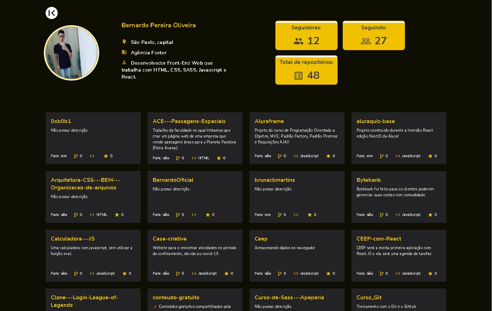

# Github Search

Acesse a aplicação e coloque seu username do github para visualizar seu perfil e repositórios de uma maneira criativa.

## Tecnologias utilizadas

- ReactJS
- React Router DOM
- Styled-components
- API Github
- MaterialUI Icons

## Resultado da busca do username:

## Projeto 

Teste o projeto: [Acessar o Projeto](https://github-search-git-main-bernardooficial.vercel.app/).